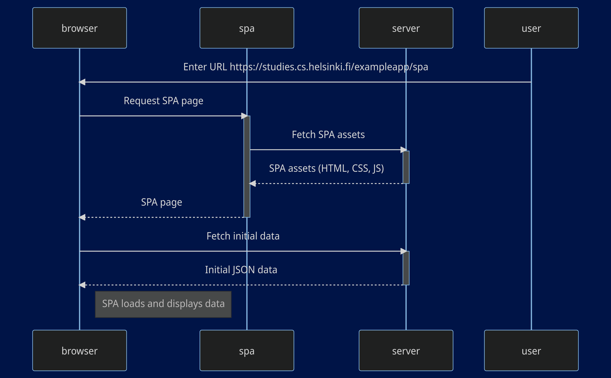

sequenceDiagram
    participant browser
    participant spa
    participant server
    participant user

    user->>browser: Enter URL https://studies.cs.helsinki.fi/exampleapp/spa
    browser->>spa: Request SPA page
    activate spa
    spa->>server: Fetch SPA assets
    activate server
    server-->>spa: SPA assets (HTML, CSS, JS)
    deactivate server
    spa-->>browser: SPA page
    deactivate spa
    browser->>server: Fetch initial data
    activate server
    server-->>browser: Initial JSON data
    deactivate server

    Note right of browser: SPA loads and displays data
